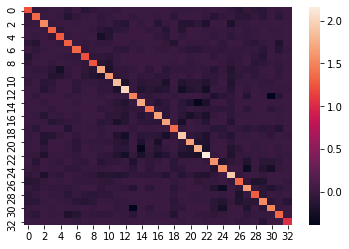
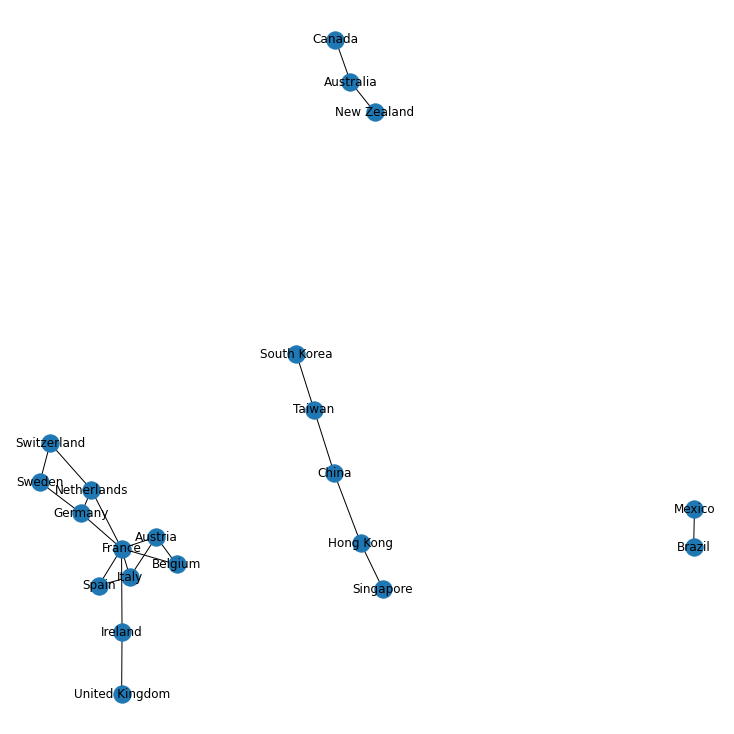

# graphical_lasso
graphical lasso for financial data
 Repo to illustrate glasso application to identify the portfolio of correlated stocks.

## How to get the pairs:
Simply execute the jupyter notebook

## Results:
Precision Matrix across markets:

Trading Pairs:

Based on article from [Jason X. Yang](https://medium.com/@xi_x_yang). I have added the entire data pipeline and preprocession along with some modifications so that you can simply execute the jupyter notebook and obtain the results in one single click.
 
